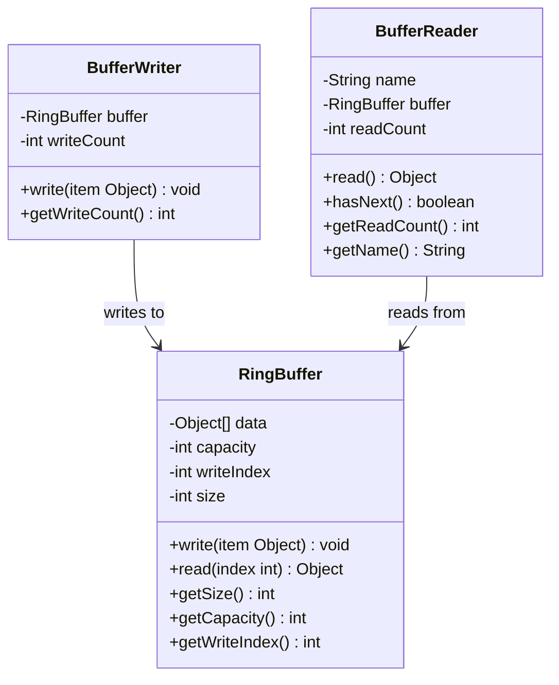
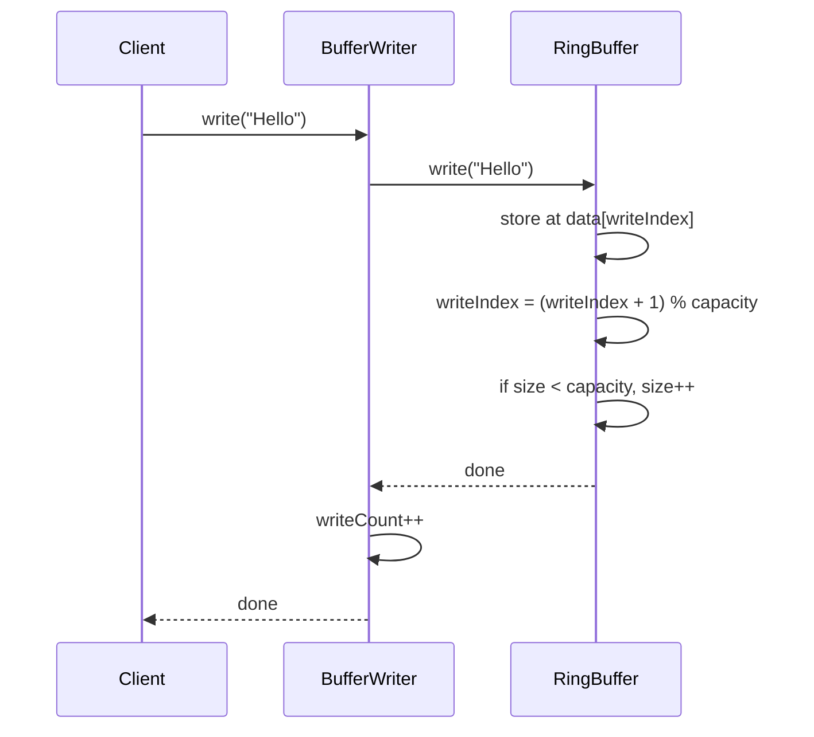
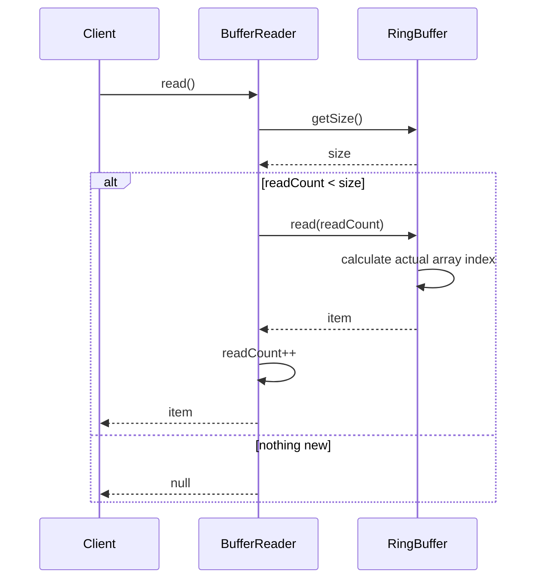

# Ring Buffer – Multiple Readers, Single Writer

## Overview

This project implements a **Ring Buffer** (circular buffer) in Java that supports:
- **One writer** that writes items into a fixed-size buffer
- **Multiple readers**, each reading independently from the same buffer
- When the buffer is full, the writer **overwrites the oldest data**
- Slow readers may **miss items** if the writer laps them

---

## Project Structure
```
RingBuffer-MultiReader/
├── RingBuffer.java      # The core circular buffer (data + write logic)
├── BufferWriter.java    # Wraps the write operation for the single writer
├── BufferReader.java    # Each reader has its own reading position
├── Main.java            # Demo with 1 writer and 3 readers
└── README.md
```

---

## Design Explanation

### `RingBuffer`
Holds the fixed-size array, the write pointer, and the current size. It knows nothing about who is reading — it just stores data and lets readers access items by index.

### `BufferWriter`
A simple wrapper around `RingBuffer.write()`. Only one `BufferWriter` should exist per buffer. Tracks how many items have been written.

### `BufferReader`
Each reader has its own `readCount` that tracks how far it has read. Reading does not remove data — it just advances the reader's own pointer. If the buffer has been overwritten past a reader's position, that reader may miss items.

---

## UML Class Diagram


---

## UML Sequence Diagram – write()


---

## UML Sequence Diagram – read()


---

## How to Run

### Requirements
- Java 8 or higher

### Steps

1. Clone or download the repository:
```bash
   git clone 
   cd 
```

2. Compile all Java files:
```bash
   javac *.java
```

3. Run the demo:
```bash
   java Main
```
